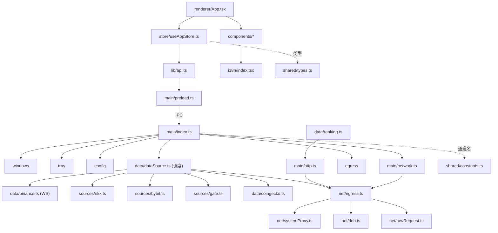

# 系统架构与模块依赖

```yaml
doc: architecture
project: crypto-ticker
audience: AI
scope: 进程模型 / 模块职责 / 依赖关系
```

## 1. 进程模型（Electron 三进程）

```mermaid
flowchart LR
  subgraph Main["主进程 (Node.js, dist/main/index.js)"]
    M1[lifecycle: 单实例锁/托盘/全局快捷键]
    M2[IPC 路由 ipcMain]
    M3[点击穿透光标轮询器 100ms]
    M4[DataService 行情调度]
    M5[智能出口路由器 egress]
    M6[网络状态监控 network]
    M7[config electron-store]
  end
  subgraph Preload["Preload (contextBridge)"]
    P1[window.api 白名单桥]
  end
  subgraph Renderer["渲染进程 (React, contextIsolation:true)"]
    R1[zustand useAppStore]
    R2[组件树 MiniWindow/*]
    R3[i18n Provider]
  end
  Main -- "IPC (shared/constants.ts IPC 对象)" --> Preload
  Preload -- "window.api.*" --> Renderer
```



安全基线：`contextIsolation: true`、`nodeIntegration: false`、sandbox: false（preload 需要 require），外部链接由主进程域名白名单校验后才 `shell.openExternal`。

## 2. 模块职责表

| 模块路径 | 职责 | 关键导出 |
|---|---|---|
| `src/shared/types.ts` | 全部跨进程类型 + `AppConfig`/`DEFAULT_CONFIG`/`TOP10_COINS` | `AppConfig`, `Ticker`, `CoinEntry`, `NetworkStatus` 等 |
| `src/shared/constants.ts` | IPC 通道名集中定义（**改 IPC 必改这里**）| `IPC`, `CLICK_THROUGH_ACCELERATOR`, `SOURCE_LABELS` |
| `src/main/index.ts` | 应用生命周期、全部 ipcMain 注册、穿透悬停检测器、代理应用、外部链接白名单 | — |
| `src/main/windows.ts` | 无边框透明悬浮窗创建（260x360, frame:false, transparent:true）| `createMiniWindow()` |
| `src/main/tray.ts` | 系统托盘（点击切换窗口、右键菜单：退出/穿透切换）| `createTray()` |
| `src/main/config.ts` | electron-store 持久化 + 老配置迁移（旧默认 BTC/ETH→Top10，新字段合并默认值）| `loadConfig()`, `saveConfig()` |
| `src/main/preload.ts` | contextBridge 暴露 `window.api`（与 IPC 通道一一对应）| — |
| `src/main/network.ts` | 网络状态检测与推送（online/reachable/degraded/type/ipv4/dnsBlocked）| `startNetworkMonitor()`, `onNetworkStatus()` |
| `src/main/http.ts` | `getJson()`：经出口路由器选路的 HTTP GET（超时/重试/代理）| `getJson`, `GetJsonOptions` |
| `src/main/data/dataSource.ts` | **行情调度中心**：WS 实时流 + REST 快照链容灾 + 熔断冷却 + 出口切换刷新 | `DataService` 类 |
| `src/main/data/binance.ts` | Binance WS 逐交易对 miniTicker 订阅（断线重连）+ REST 快照 | `BinanceStream`, `fetchBinanceSnapshot()` |
| `src/main/data/sources/{okx,bybit,gate}.ts` | 各交易所 REST 快照适配器 | `fetchXxxSnapshot(watchlist, quote, opts)` |
| `src/main/data/coingecko.ts` | CoinGecko 快照 + trending 热门榜 + 市值榜（CoinCap 降级） | `fetchCoinGeckoSnapshot()`, `fetchTrendingCoins()` |
| `src/main/data/ranking.ts` | 五类榜单（涨幅/跌幅/新币/市值/成交额，top15）| `fetchRanking(kind)` |
| `src/main/data/trending.ts` | CoinGecko trending 热门榜封装 | `fetchTrendingCoins()` |
| `src/main/net/egress.ts` | **智能出口路由器**：配置代理→系统代理→本地端口扫描→DoH 直连；60s TTL；失败重探；onEgressChanged 广播 | `ensureEgress()`, `getProxyAgent()`, `setConfiguredProxy()`, `onEgressChanged()` |
| `src/main/net/doh.ts` | DoH 解析（doh.pub/alidns），绕过本地 53 劫持 | `resolveDoh()` |
| `src/main/net/systemProxy.ts` | 读 Windows 注册表系统代理 | `readSystemProxy()` |
| `src/main/net/rawRequest.ts` | 裸 HTTPS 请求（带代理 agent / 自定义解析 IP）| `rawGet()` |
| `src/main/net/logger.ts` | 网络事件日志 `netLog(event, data)` | `netLog()` |
| `src/renderer/App.tsx` | 渲染根：init store、订阅 IPC 推送、装配 MiniWindow | — |
| `src/renderer/store/useAppStore.ts` | zustand 全局状态：config/tickers/sourceStatus/networkStatus + 行动 | `useAppStore` |
| `src/renderer/lib/api.ts` | `window.api` 类型化封装（preload 桥的消费侧）| `api` |
| `src/renderer/components/MiniWindow.tsx` | 主界面：标题栏 logo、币种行列表、底部操作条（搜索+联想/榜单按钮/多选按钮）、多选操作条（全选/移除/取消）、缩放手柄 | — |
| `src/renderer/components/CoinRow.tsx` | 单币行：价格/涨跌幅/平台跳转/拖拽排序/勾选 | — |
| `src/renderer/components/AddCoinModal.tsx` | 添加币种弹窗：7 个榜单 Tab（主流/热门/涨幅/跌幅/新币/市值/成交额）；搜索在主窗底栏非本弹窗 | — |
| `src/renderer/components/SettingsPanel.tsx` | 设置面板：语言/数据源/计价币/刷新/代理/外观/穿透/自启 | — |
| `src/renderer/components/NetworkIndicator.tsx` | 网络状态指示灯 + 诊断详情面板 | — |
| `src/renderer/components/RefreshTime.tsx` | 「更新于 X 前」相对时间 | — |
| `src/renderer/components/PlatformBar.tsx` | 「查看交易:」平台跳转条 | — |
| `src/renderer/components/ClickThroughEscape.tsx` | 穿透态退出悬浮按钮（上报按钮矩形给主进程）| — |
| `src/renderer/data/platforms.ts` | 交易所跳转 URL 模板（OKX 用 trade-spot/ 路径）| — |
| `src/renderer/data/coins.ts` | 币种元数据查找（name/coingeckoId）| `findCoin()` |
| `src/renderer/i18n/` | zh.ts + en.ts（`en: typeof zh` 同构校验）+ index.tsx Provider | `useI18n()` |

## 3. 模块依赖图（关键路径）



依赖纪律：
- `shared/` 不依赖任何一侧，是唯一共享层；主↔渲染只通过 IPC（通道名集中在 `shared/constants.ts`）。
- 主进程 data 模块之间用**延迟 require** 避免循环依赖（dataSource → binance/sources）。
- 渲染进程禁止直接访问 Node/Electron API，只经 `window.api`（preload 白名单桥）。

## 4. 窗口与穿透机制（Windows 特化实现）

- 穿透开启：`setIgnoreMouseEvents(true, {forward:true})` + 主进程每 100ms 轮询 `screen.getCursorScreenPoint()`。
- 交互判定：光标命中「右上角按钮矩形」（渲染进程经 `window:click-through-btn-rect` 上报）或设置面板 hold（`window:click-through-hold`）时，临时 `setIgnoreMouseEvents(false)` 并 `win.focus()`（无边框失焦窗首次点击只激活不触发 click 的坑）；离开区域恢复穿透。
- 原因：Windows 下 forward 转发依赖窗口焦点，失焦后渲染进程收不到鼠标事件，故用主进程全局光标轮询兜底。

## 5. 构建产物布局

```
crypto-ticker/
├── src/                  # 源码（见上表）
├── scripts/              # make-icon.mjs / fix-vite-crypto.cjs / run-electron.cjs / smoke-*.cjs
├── patches/              # vite+5.4.21.patch (Node<19 crypto polyfill, postinstall 自动应用)
├── assets/               # icon.ico (win) / icon.png 1024 (mac)
├── dist/main/            # tsc 产物（index.js + preload.js）
├── dist/renderer/        # vite 产物（index.html + assets/*)
├── release/              # electron-builder 产物（win-unpacked/ + CryptoTicker Setup x.x.x.exe）
├── electron-builder.yml  # 打包配置（win NSIS + mac dmg/zip）
└── run.bat               # Windows 一键启动脚本
```
