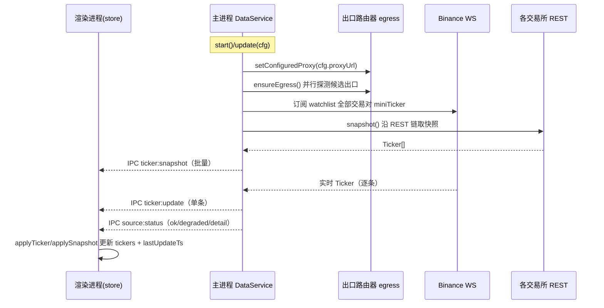
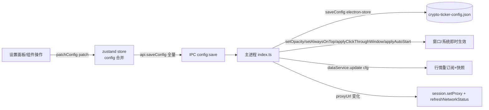
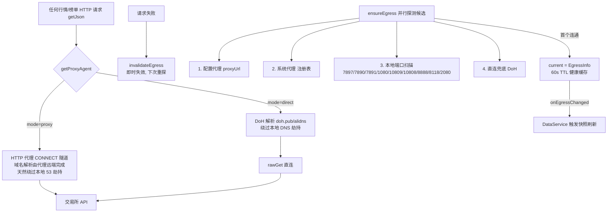
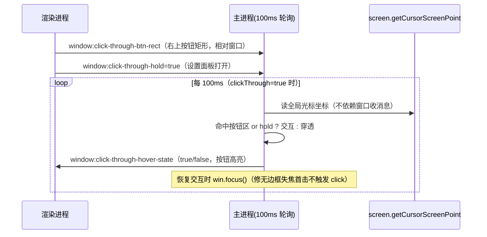

# 数据流

```yaml
doc: dataflow
project: crypto-ticker
audience: AI
scope: 行情流 / 配置流 / 网络出口流 / 穿透交互流 / 榜单流
```

## 1. 行情数据流（核心链路）



REST 快照链（`candidates()`）：
- `auto`（默认）：`['okx','binance','bybit','gate','coingecko']` 顺序尝试，任一成功即返回；第 2 顺位起视为「兜底生效」状态。
- 指定单一源：只试该源。
- 熔断：单源连续失败 ≥3 次 → 冷却 120s 内跳过，到期自动恢复试探。

状态语义（`SourceStatus`）：
| ok | degraded | 含义 |
|---|---|---|
| true | false | WS 实时主通道正常 |
| true | true | 有数据但非实时主通道（WS 断线走 REST / 备源兜底） |
| false | — | 完全拿不到数据（含全部源熔断中） |

触发快照刷新的事件：启动、`update(cfg)`（配置变更）、WS 断线（auto 模式）、出口切换（`onEgressChanged` 防抖 300ms）。

刷新模式：
- `realtime`（默认）：WS 推送为主，REST 快照兜底。
- `poll`：`setInterval(max(5, refreshIntervalSec)*1000)` 轮询快照；`coingecko` 源强制走 poll。

## 2. 配置流



反向同步：托盘菜单/全局快捷键在主进程改配置后，经 `IPC config:changed` 广播全量配置 → store.set({config})，保持界面复选框与实际状态一致。

## 3. 网络出口选路流（egress）



探针端点：`api.coingecko.com/api/v3/ping`（与业务同源）→ `www.gstatic.com/generate_204`；探测超时 6s，端口扫描超时 400ms。

## 4. 点击穿透交互流



切换入口（统一走 `setClickThroughState`）：设置面板 IPC、托盘菜单、全局快捷键 Ctrl+Shift+X（穿透/隐藏/最小化态均可触发）。

## 5. 榜单与添加币种流

```mermaid
flowchart LR
  MOD[AddCoinModal 打开] -->|Tab 切换| Q{榜单类型}
  Q -->|trending| T[IPC coins:fetch-trending<br/>CoinGecko trending]
  Q -->|gainers/losers/volume| K[IPC coins:fetch-ranking<br/>OKX tickers 排序]
  Q -->|new| N[Gate currency_pairs<br/>buy_start 降序, 过滤杠杆币]
  Q -->|marketcap| MC[CoinGecko markets<br/>失败降级 CoinCap]
  T & K & N & MC --> LIST[CoinEntry[] top15]
  LIST --> UI[渲染榜单]
  UI -->|点 + 添加| ADD[store.addCoin]
  ADD --> CFG[config:save → DataService.update 重订阅]
```

## 6. 外部跳转流（安全边界）

渲染进程 `api.openExternal(url)` → 主进程 `openExternalSafe`：仅接受 `https:` 协议且域名命中白名单（binance.com / okx.com / gate.io / coingecko.com / coinmarketcap.com / bybit.com / bitget.com / htx.com / kucoin.com / t.me / x.com / twitter.com 及其子域名），否则静默忽略。交易所 URL 模板集中在 `src/renderer/data/platforms.ts`（注意 OKX 现货路径为 `/trade-spot/`）。
