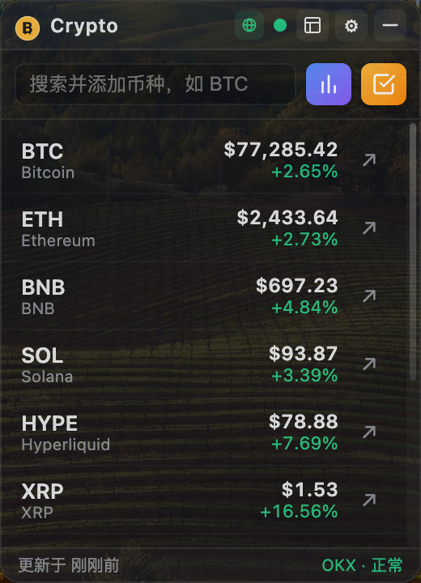
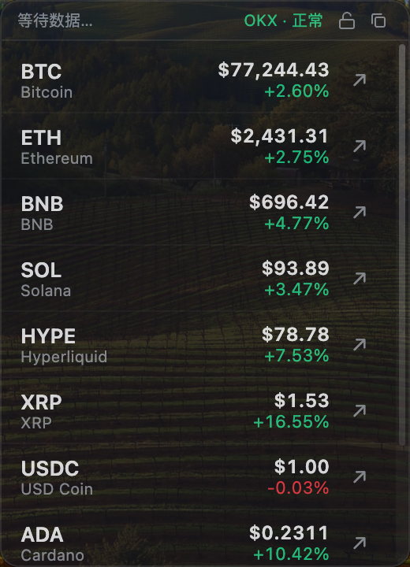

# CryptoTicker

[](LICENSE)
[](#下载)
[](#技术栈)

**桌面加密货币价格悬浮窗。** 无边框、透明、可点击穿透——实时行情常驻屏幕一角，完全不挡操作，一键直达交易所。

[English](./README.md)

---

## 为什么做 CryptoTicker

开网页盯盘太重太分心，而普通行情工具在代理或 DNS 污染的网络下经常直接罢工。CryptoTicker 同时解决这两件事：

- **轻**：无边框半透明小窗贴在角落，只显示你最关心的价格与涨跌。
- **稳**：多数据源自动容灾（OKX → Binance → Bybit → Gate → CoinGecko），加上**智能出口路由**（配置代理 → 系统代理 → 本地端口探测 → DoH 直连），零配置也能在代理/劫持网络下存活。
- **快**：Binance WebSocket 实时推送，毫秒级更新，一键跳转交易页下单。

## 功能特性

| | |
|---|---|
| 🪟 **悬浮窗** | 无边框透明置顶小窗 · 透明度 30%–100% · 自由拖拽 · 右下角缩放 · 尺寸自动记忆 |
| ⭐ **自选列表** | 增删币种 · 拖拽排序 · 多选批量操作 · 默认市值 Top 10 |
| ⚡ **实时行情** | Binance WebSocket 推送 · REST 快照容灾链 · 单源熔断（连败 3 次冷却 120 秒） |
| 🔀 **数据控制** | 数据源：OKX / Binance / Bybit / Gate.io / CoinGecko / 自动 · 计价币 USDT / USDC / FDUSD · 实时/轮询模式 |
| 🔍 **发现新币** | 搜索 + 7 大榜单：主流币 · 热门 · 涨幅榜 · 跌幅榜 · 新币榜 · 市值榜 · 成交额榜 |
| 🖱 **点击穿透** | 窗口变「贴纸」，鼠标点击直达下层应用；`Ctrl+Shift+X` 随时切换，智能悬停识别保证按钮仍可点 |
| 🌐 **智能网络** | 出口路由：配置代理→系统代理→本地端口扫描→DoH 直连 · 网络诊断面板（连通性/当前出口/DNS 劫持检测） |
| 🚀 **一键交易** | 直达 Binance / OKX / Gate.io 对应交易对页面（域名白名单校验） |
| 🧩 **桌面友好** | 系统托盘 · 开机自启 · 单实例 · 高 DPI 适配 · 中英文界面 |

> 注：涨跌配色遵循国内交易所习惯——涨红、跌绿。

### 界面预览

**完整模式——含标题栏、搜索与状态栏**
主视图：顶部为 ₿ 徽章与标题，中间是带「发现/添加」快捷入口的搜索框，工具栏包含数据源切换、复制、设置、最小化等按钮，底部状态栏显示最近刷新时间和当前数据源状态。



**极简模式——只看自选列表**
切换到极简视图后隐藏标题栏、搜索框与状态栏，只保留币种列表与顶部数据源徽章，便于贴在屏幕角落长时间盯盘而不打扰。



## 下载

获取最新版 macOS 安装包：

[](https://github.com/MoScl/crypto-ticker/releases/latest/download/CryptoTicker-universal.dmg)
[](https://github.com/MoScl/crypto-ticker/releases/latest/download/CryptoTicker-arm64-mac.zip)

> **macOS**：universal dmg 同时支持 Apple Silicon 与 Intel（macOS 11+）。应用未签名，首次运行请右键 →「打开」。
>
> **Windows**：NSIS 安装包规划中，当前可在 Windows 机器上 `npm run dist` 自行构建。

## 快速开始（源码运行）

```bash
npm install   # 自动应用 patch-package 补丁
npm run dev   # tsc watch + vite + electron 三进程并行
```

环境要求：Node.js ≥ 16（推荐 18/20/22）。详见[开发指南](doc/development.md)。

### 构建安装包

```bash
npm run dist                 # Windows：release/CryptoTicker Setup x.x.x.exe（NSIS）
npx electron-builder --mac   # 仅 macOS 上可执行：产出 dmg + zip
```

## 使用方式

- **移动/缩放**：拖拽标题栏移动；拖右下角手柄缩放。
- **添加币种**：底部搜索框输入符号（联想+回车直加）；或点柱状图按钮打开榜单弹窗，在 7 个 Tab 中点行尾「＋」。
- **删除币种**：点勾选图标进入多选模式 → 勾选行 → 「移除」。
- **点击穿透**：设置面板 / 托盘菜单 / `Ctrl+Shift+X` 三种开关方式。开启后点击全部穿透，仅鼠标移到右上角按钮区（自动识别）或打开设置面板时恢复可交互。
- **退出**：托盘右键 → 退出（窗口 ✕ 按钮仅隐藏）。

完整说明见[用户手册](doc/user-guide.md)。

## 技术栈

Electron 30 · React 18 · TypeScript 5.5 · Vite 5 · Zustand 4 · electron-store · ws，以及为智能出口路由自研的 HTTP/DoH 网络层。所有数据源均**无需 API key**。

```
主进程                            渲染进程 (React + Zustand)
├── DataService  ← WS + REST 链    ├── MiniWindow / CoinRow
├── 智能出口路由 (代理/DoH)         ├── AddCoinModal（7 大榜单）
├── 网络状态监控                    ├── SettingsPanel / NetworkIndicator
├── 穿透光标轮询器                  └── i18n（中/英，编译期同构校验）
└── 托盘 / 快捷键 / 配置
        └──────── IPC (shared/constants.ts) ────────┘
```

架构详解：[设计文档](doc/design.md) · 机器可读文档：[`.agent/`](.agent/README.md)

## 目录结构

```
src/shared/    跨进程共享层：类型定义 + IPC 通道名（唯一事实来源）
src/main/      主进程：窗口/托盘/出口路由/行情调度/交易所适配器
src/renderer/  渲染进程：React 组件、zustand store、i18n
doc/           人类阅读文档（总览/用户手册/开发指南/设计文档）
.agent/        AI 可读文档（架构/数据流/IPC/配置，结构化格式）
```

## 文档导航

| 文档 | 受众 |
|---|---|
| [项目总览](doc/overview.md) | 所有人：背景、功能、架构、技术栈 |
| [用户手册](doc/user-guide.md) | 最终用户 |
| [开发指南](doc/development.md) | 贡献者 |
| [设计文档](doc/design.md) | 架构决策与关键机制 |
| [`.agent/`](.agent/README.md) | AI / 工具 |

## 路线图与已知限制

- 多监视列表 / 多窗口
- 浅色主题（字段已预留）
- electron-updater 自动更新
- Linux 支持

## 参与贡献

欢迎 PR。提交前：`npm run typecheck` 必须零错误；新增 UI 文案须同时加到 `src/renderer/i18n/zh.ts` 与 `en.ts`（有编译期校验兜底）；IPC / 配置变更请同步更新 `.agent/ipc-interfaces.md` / `.agent/config-reference.md`。详见[开发指南](doc/development.md)。

## 许可证

[MIT](LICENSE)
